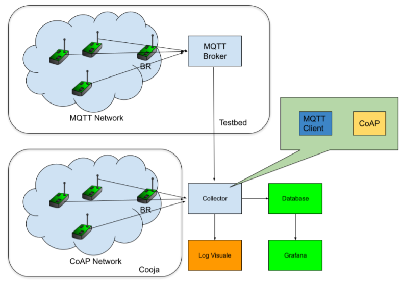

# InternetOfThings_SmartPool
Project for the <i>'Internet of Things'</i> course. Please, check the [Documentation](Documentation.pdf) for a complete view. 

## Introduction
Smart Pool is an automation application for smart management of swimming pools.
It allows to automatically manage the pool temperature and the chlorine level.
For facilities with hydromassage services, it allows the automated management of the
water inlets.
It also offers the ability to manually apply a certain degree of parameter changes, eg. to
set the desired water temperature, at run time.

## System scheme and structure

## Deployment
### MQTT Network
The MQTT network is deployed using the 4 real sensors from the testbed that have been provided to us. We have decided to use these devices in the following way:
- 1 device deployed as Border Router
- 1 device deployed both as Temperature detector and Temperature regulator
- 1 device deployed both as Chlorine level detector and regulator
- 1 device left unused to eventually show some additional features that we implemented

### CoAP Network
On the CoAP network simulated with Cooja we then decided to deploy the sensor and the actuator related to the hydromassage, which are the Presence detector and the Hydromassage actuator.

### Collector & Control Logic
The Collector is responsible of accepting connection of CoAP devices and receiving updates from the MQTT Broker. In combination with it, we execute some control logic that allows:
- Automatic management of actuators (e.g. automatic management of temperature regulators state)
- Manual modifications to the actuators and some parameters used for the automatic management 

We provide the user with a CLI with the following commands available:
- !exit
- !commands
- !checkTemp
- !setTemp <lower temperature> <upper temp> <unit[C or F]>
- !checkCl
- !setCl <lower level> <upper level>
- !setPowerHydro <new power>
- !getSensorsList
